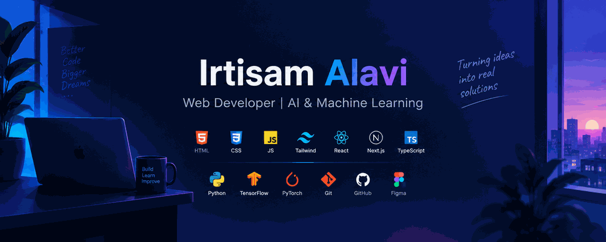

  

  

<h1 align="center">
  Irtisam Alavi
</h1>

  

  
  
  

  
    Turning ideas into functional, meaningful & user-focused digital experiences.
  

 

  

 
<!-- ═════════════════════════════════════════════════════════════ -->
<!--                     03 • ABOUT ME                            -->
<!-- ═════════════════════════════════════════════════════════════ -->

 

  

  <b>Building • Designing • Learning • Experimenting</b>

 

<table align="center" width="92%">
<tr>
<td width="58%" valign="top">

### 👋 Hello, I'm Irtisam

I'm a **Computer Science student and project-focused developer** who enjoys turning ideas into practical digital products.

My main interests sit at the intersection of **Web Development, UI/UX Design, and AI & Machine Learning**. I enjoy working through the complete product journey — from shaping an idea and designing its interface to developing a functional and user-friendly experience.

I'm constantly experimenting with new technologies, improving my problem-solving skills, and building projects that combine **technology, design, and real-world usability.**

 

  
  
  

</td>

<td width="42%" valign="top">

  

 

  

  

  

  

  

</td>
</tr>
</table>

 

  

 

  

 
<!-- ═══════════════════════════════════════════════ -->
<!--              04 • CURRENTLY                    -->
<!-- ═══════════════════════════════════════════════ -->

 

  

  What I'm building, exploring & learning.

 

  ⚡ <b>Building</b> &nbsp; Web Applications & Real-World Projects
    
  🌱 <b>Exploring</b> &nbsp; Next.js, TypeScript & Modern React
    
  🤖 <b>Learning</b> &nbsp; AI, Machine Learning & Problem Solving
    
  🎨 <b>Designing</b> &nbsp; UI/UX, Product Interfaces & Figma

 

  

<!-- ═══════════════════════════════════════════════ -->
<!--              05 • TECH STACK                   -->
<!-- ═══════════════════════════════════════════════ -->

 

  

 

  Technologies I use to build, design & experiment.

 

  

  

 

  

<!-- ═══════════════════════════════════════════════ -->
<!--                  07 • GITHUB                    -->
<!-- ═══════════════════════════════════════════════ -->

 

  

  Code • Build • Experiment • Repeat

 

  

 

  
  &nbsp;
  
  &nbsp;
  

 

  

 
<!-- ═══════════════════════════════════════════════ -->
<!--          08 • CONTRIBUTION STREAK              -->
<!-- ═══════════════════════════════════════════════ -->

 

  

  Consistency • Progress • Keep Building

 

  

 

  

 
